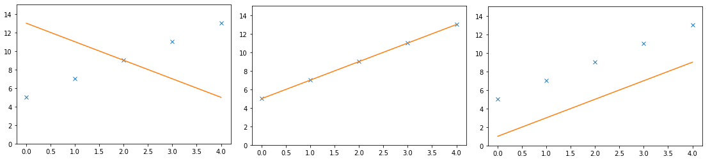
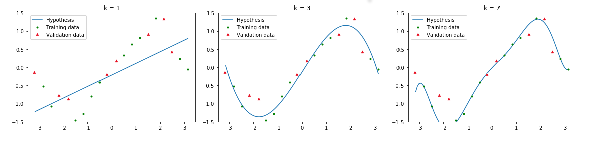
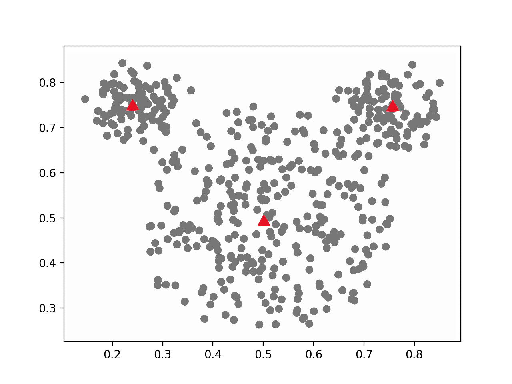

# Practice exam questions

## 1. Classifying problems

* Explain the difference between supervised and unsupervised learning.
* Explain the difference between classification and regression.

For each of the problem descriptions below, indicate what *type* of machine learning algorithm would be most suited to solving it. So, would you use a supervised or unsupervised approach for the problem, and specifically, would you use regression, classification or clustering. Motivate your answers.

* Predict the number of millimeters of rain that will fall tomorrow, based on attributes like humidity and atmospheric pressure, using meteorological records of these attributes and the measured rainfall from previous days.
* Using patient data from earlier studies, where several patient were monitored for 6 months for blood values such as glucose and cholesterol levels, and whether they had a heart attack in that time period, predict if a new patient is likely to have have a heart attack based on their current blood values.

## 2. Data sets

* Explain the difference between training and validation data, and how both are used by a supervised learning algorithm.
* Explain the difference between validation and testing data, and why these two parts of the data should not overlap.

## 3. k-Nearest Neighbours

* For which value of $k$ is k-NN equal to the nearest neighbour algorithm?
* Explain why you would always use an uneven value for $k$ specifically when doing binary classification.

## 4. Naive Bayes

* Naive Bayes uses Bayes' rule to rewrite the posterior probability in terms of the prior and likelihood. Explain why this rewrite is done, instead of just estimating the posterior probability directly.
* The estimations of the likelihood in this algorithm are considered *naive*, at least, that is where the algorithm gets the other half of its name. Explain why this computation is considered a naive.

## 5. Linear Regression

The figure above shows 3 different linear regression models, for the same 5 data points. 

* Order these 3 linear models from lowest to highest cost for the 5 plotted data points. No need to compute the cost exactly, but motivate your answer for each graph.
* Explain why the point where the gradient of the cost is exactly 0 in both directions, is the also best possible value of $a$ and $b$ for the data set.
* Explain what the learning rate is and what it does in gradient descent.

## 6. Polynomial Regression

Consider the univariate regression data above. The green dots are the training samples, the red triangles are the validation samples and the blue line represents the learned hypothesis. The each model is learned using polynomial regression, using a different polynomial degree, which is indicated above the each plot by the $k$ parameter.

* Which of these plots (k= 1, 3 and 7) results in the lowest training cost? And which plot results in the lowest validation cost? Explain your answers.
* For each of the three plots, indicate whether the model underfits, overfits or fits well. For each of your three answers, explain what parts of the plot indicate that type of fit.
* For each plot separately, answers the following question: What are the dimensions of the training data matrix after the polynomial feature expansion is applied?

## 7. k-Means

The figure above shows a data set that is being clustered using the k-means algorithm. The data is indicated by dots, and the current means are indicated by red triangles.

* Run a single iteration of the k-means algorithm on this data set, doing both steps (no need to write out all results here). Does the algorithm converge after this iteration? Explain your answer.
* Name two methods you could use to determine what value of $k$ you should use for k-means.

